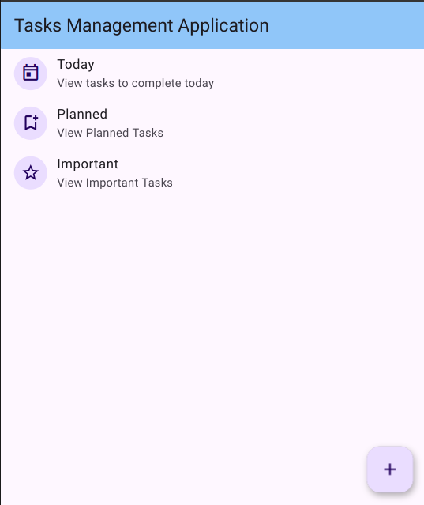
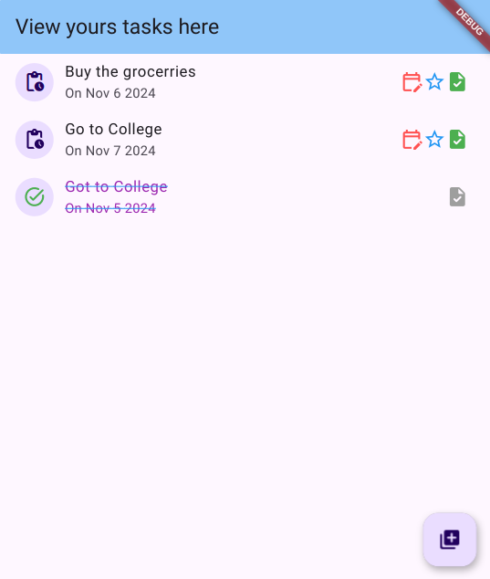
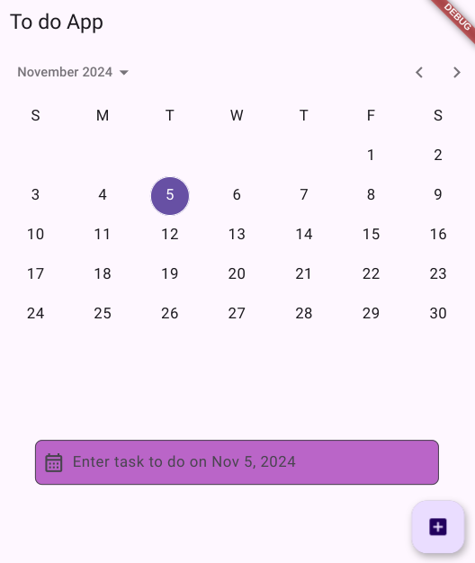

### Flutter todo app

App Images : 

On first page we can add categories, and browse them

On the second page we can mark tasks as completed and edit them, or add them in important tasks.

Upon clicking add button on 2nd screen we go to the tasks adding screen

Here we can write tasks for different days, and upon revisting we have our tasks,(done by using provider state)

App is not fully functional now